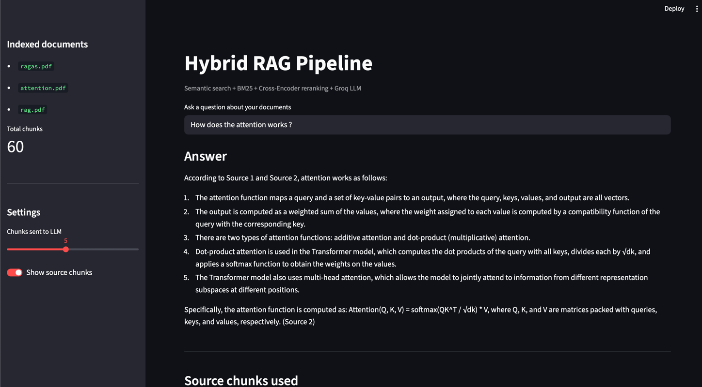

# Hybrid RAG Pipeline

A Retrieval-Augmented Generation system built from scratch in Python. Ask questions in natural language and get precise answers with citations from your own PDF documents.



---

## How it works

Standard LLMs cannot read your private documents and tend to hallucinate when they lack information. This pipeline solves both problems by retrieving the most relevant passages from your PDFs before generating an answer — the LLM only sees what it needs.

```
PDF documents
     │
     ▼
Preprocessing      clean raw text extracted from PDFs
     │
     ▼
Chunking           split into overlapping chunks (Parent-Child strategy)
     │
     ├──────────────────────────┐
     ▼                          ▼
Semantic search            BM25 search
(ChromaDB + embeddings)    (keyword matching)
     │                          │
     └──────────┬───────────────┘
                ▼
          RRF Fusion         merge both result lists by rank
                │
                ▼
        Cross-Encoder        rerank top chunks with (query, chunk) pairs
                │
                ▼
           Groq LLM          generate answer strictly from retrieved context
                │
                ▼
        Answer + citations
```

## Stack

| Component | Technology |
|---|---|
| PDF extraction | PyMuPDF |
| Chunking | Custom Parent-Child strategy |
| Embeddings | `all-MiniLM-L6-v2` (sentence-transformers) |
| Vector store | ChromaDB |
| Keyword search | BM25 (rank-bm25) |
| Fusion | Reciprocal Rank Fusion (RRF) |
| Reranking | `ms-marco-MiniLM-L-6-v2` (Cross-Encoder) |
| LLM | Groq API (`llama-3.3-70b-versatile`) |
| Interface | Streamlit |


## Setup

```bash
git clone https://github.com/your-username/rag_project
cd rag_project
pip install -r requirements.txt
```

Create a `.env` file at the project root:

```
GROQ_API_KEY=your_key_here
```

Get a free Groq API key at [console.groq.com](https://console.groq.com).

Add your PDF files to `data/pdfs/`, then launch the app:

```bash
streamlit run app/streamlit_app.py
```

## Key design choices

**Why hybrid retrieval?** Semantic search (embeddings) captures meaning but struggles with rare technical terms. BM25 handles exact keyword matching. Combining both with RRF covers cases that either method alone would miss.

**Why Parent-Child chunking?** Small child chunks (512 words) produce precise embeddings for retrieval. Their larger parent chunks (1024 words) are sent to the LLM for richer context. This avoids the trade-off between retrieval precision and answer quality.

**Why a Cross-Encoder for reranking?** Unlike bi-encoder embeddings which encode query and chunk separately, a Cross-Encoder reads both together. This produces significantly more accurate relevance scores, at the cost of speed — which is why it is only applied to the top 10 candidates from RRF.

## Requirements

```
pymupdf
sentence-transformers
chromadb
rank-bm25
groq
python-dotenv
streamlit
```